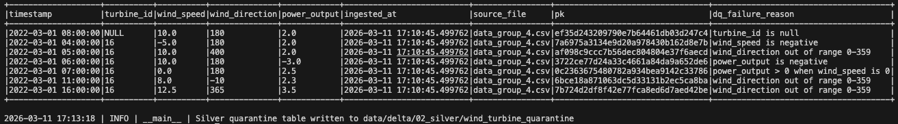
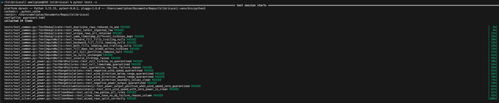

# ColibriLocal

A local PySpark + Delta Lake medallion pipeline for wind turbine power data. Ingests raw CSV readings, applies data quality checks and null imputation, then produces aggregated fleet performance and anomaly detection outputs.

---

## Architecture

The pipeline follows a three-layer medallion architecture, each layer persisted as a Delta table.

```
data/raw/wind_turbines/*.csv
        │
        ▼
┌──────────────────────────────────────┐
│  Bronze  (01_bronze)                 │
│  wind_turbines                       │
│  Incremental ingest via file mtime   │
│  watermark. MERGE on MD5(turbine_id, │
│  timestamp). Audit cols added.       │
└──────────────────┬───────────────────┘
                   │
                   ▼
┌──────────────────────────────────────┐
│  Silver  (02_silver)                 │
│  wind_turbine_clean                  │
│  wind_turbine_quarantine             │
│  Deduplicate → impute nulls → DQ     │
│  rules. Failed rows routed to        │
│  quarantine with failure reason.     │
└──────────────────┬───────────────────┘
                   │
                   ▼
┌──────────────────────────────────────┐
│  Gold  (03_gold)                     │
│  fct_turbine_power_snapshot          │
│  Per-turbine aggregates (min/max/avg │
│  power) + fleet benchmarks + z-score │
│  anomaly flags. MERGE on             │
│  (turbine_id, period, window_type).  │
└──────────────────────────────────────┘
```

A Delta control table at `00_control/watermarks` tracks the last processed file mtime, making Bronze ingestion idempotent across reruns.

---

## Project Structure

```
ColibriLocal/
├── data/
│   ├── raw/wind_turbines/          # Source CSV files
│   └── delta/
│       ├── 00_control/watermarks   # Pipeline watermark
│       ├── 01_bronze/              # Raw Delta table
│       ├── 02_silver/              # Clean + quarantine Delta tables
│       └── 03_gold/                # Fact table partitioned by window_type
├── src/
│   ├── core/
│   │   ├── bronze/bronze_wt_power.py
│   │   ├── silver/silver_wt_power.py
│   │   └── gold/gold_wt_power.py
│   ├── pipelines/
│   │   └── pl_wt_power.py          # Orchestrator: Bronze → Silver → Gold
│   └── utils/
│       ├── common.py               # SparkSession, transforms, watermark helpers
│       └── constants.py            # All table paths and config values
├── tests/
│   ├── conftest.py                 # Session-scoped Spark fixture
│   ├── test_common.py              # Unit tests: deduplicate, impute_nulls
│   └── test_silver_wt_power.py     # Unit tests: DQ rules
└── pyproject.toml
```

---

## Data Schema

### Raw input (`data/raw/wind_turbines/*.csv`)

| Column           | Type      | Description                       |
|------------------|-----------|-----------------------------------|
| `timestamp`      | timestamp | Reading time (UTC)                |
| `turbine_id`     | string    | Turbine identifier                |
| `wind_speed`     | double    | Wind speed (m/s)                  |
| `wind_direction` | double    | Wind direction in degrees (0–359) |
| `power_output`   | double    | Power generated (MW)              |

### Gold output (`fct_turbine_power_snapshot`)

| Column                | Description                                         |
|-----------------------|-----------------------------------------------------|
| `turbine_id`          | Turbine identifier                                  |
| `window_type`         | Aggregation granularity (e.g. `day`, `week`)        |
| `period`              | Truncated timestamp for the aggregation bucket      |
| `min_power`           | Minimum power output in period                      |
| `max_power`           | Maximum power output in period                      |
| `avg_power`           | Average power output in period                      |
| `fleet_avg_min_power` | Fleet average of per-turbine min power              |
| `fleet_avg_max_power` | Fleet average of per-turbine max power              |
| `fleet_avg_power`     | Fleet average of per-turbine avg power              |
| `fleet_stddev`        | Standard deviation of avg_power across all turbines in the period |
| `fleet_deviation`     | `avg_power - fleet_avg_power` (signed)                            |
| `fleet_sigmas`        | `fleet_deviation / fleet_stddev` (z-score vs fleet)               |
| `is_fleet_anomaly`    | `true` if turbine deviates > 2σ from the fleet mean               |
| `turbine_avg_power`   | Turbine's own historical mean avg_power across all periods         |
| `turbine_stddev`      | Turbine's own historical standard deviation of avg_power           |
| `turbine_deviation`   | `avg_power - turbine_avg_power` (signed)                          |
| `turbine_sigmas`      | `turbine_deviation / turbine_stddev` (z-score vs self)            |
| `is_self_anomaly`     | `true` if turbine deviates > 2σ from its own historical mean      |

---

## Data Quality Rules

Applied in Silver. Rows failing any rule are routed to the quarantine table with a `dq_failure_reason` column.

| Rule                                     | Type               | Condition                          |
|------------------------------------------|--------------------|------------------------------------|
| `turbine_id` is null                     | Hard failure       | Row cannot be identified or joined |
| `timestamp` is null                      | Hard failure       | Row cannot be placed in time       |
| `wind_speed < 0`                         | Range violation    | Physically impossible              |
| `wind_direction` outside 0–359           | Range violation    | Valid compass range                |
| `power_output < 0`                       | Range violation    | Cannot generate negative power     |
| `wind_speed == 0` and `power_output > 0` | Cross-column check | No wind means no power output      |

Null imputation (forward + backward fill per turbine, ordered by timestamp) is applied **before** DQ evaluation so that recoverable rows are not unnecessarily quarantined.

### Synthetic test data — `data_group_4.csv`

A synthetic dataset was added for turbine 16 covering a full 24-hour period (`2022-03-01 00:00–23:00`). It deliberately introduces all DQ failure scenarios alongside clean rows, duplicate timestamps, and null measurements to validate the full Silver processing chain end-to-end:

The resulting quarantine output:



---

## Setup

Requires Python 3.11 and Java 11+ (needed by PySpark).

### 1. Create and activate a virtual environment

```bash
# Using uv (recommended)
uv venv
source .venv/bin/activate       # macOS / Linux
.venv\Scripts\activate          # Windows

# Or using the standard library
python3.11 -m venv .venv
source .venv/bin/activate       # macOS / Linux
.venv\Scripts\activate          # Windows
```

### 2. Install dependencies

```bash
# Using uv (recommended) — syncs exact versions from uv.lock
uv sync                  # pipeline dependencies only
uv sync --extra dev      # include pytest for running tests

# Or using pip in editable mode
pip install -e .         # pipeline dependencies only
pip install -e ".[dev]"  # include pytest for running tests
```

---

## Packaging

Build a distributable wheel that bundles the package and its Python dependencies:

```bash
uv build
# produces: dist/colibrilocal-0.1.0-py3-none-any.whl
```

Install on another machine — `pip` automatically resolves and installs `pyspark` and `delta-spark`:

```bash
pip install colibrilocal-0.1.0-py3-none-any.whl
```

> **Note:** Java 11+ must be installed separately on the target machine. It cannot be declared as a Python dependency.

After installation the `colibri-wt-power` command is available globally:

```bash
colibri-wt-power --help
```

---

## Running the Pipeline

### Full pipeline

Both invocation styles accept the same arguments. Use the module form during local development (no install required); use the console script after `pip`/`uv pip install`.

```bash
# Local development (no install required — virtual environment must be active)
python -m src.pipelines.pl_wt_power

# After package install
colibri-wt-power
```

**CLI options:**

| Argument | Description | Default |
|---|---|---|
| `--raw-path PATH` | Glob pattern for raw CSV source files | `data/raw/wind_turbines/*` |
| `--output-path PATH` | Base directory for all Delta output tables | `data/delta` |
| `--window WINDOW [...]` | One or more Gold aggregation windows | `day` |

**Examples:**

```bash
# Run with defaults
python -m src.pipelines.pl_wt_power

# Weekly aggregation only
python -m src.pipelines.pl_wt_power --window week

# Daily and weekly in a single run
python -m src.pipelines.pl_wt_power --window day week

# Custom source and output paths
python -m src.pipelines.pl_wt_power --raw-path /mnt/data/turbines/*.csv --output-path /mnt/delta

# All options together
python -m src.pipelines.pl_wt_power --raw-path /mnt/data/turbines/*.csv --output-path /mnt/delta --window day week month
```

### Individual layers

Each layer can be run standalone for development or debugging (uses default paths from `constants.py`):

```bash
python -m src.core.bronze.bronze_wt_power
python -m src.core.silver.silver_wt_power
python -m src.core.gold.gold_wt_power
```

---

## Running Tests

```bash
# Run all unit tests
pytest

# Run with verbose output
pytest -v

# Run a specific test module
pytest tests/test_silver_wt_power.py
pytest tests/test_common.py
```

Tests use a session-scoped `SparkSession` shared across all test classes to avoid repeated JVM startup overhead.

All 24 unit tests passing across deduplication, null imputation, data quality rules, and clean/quarantine routing.


---

## Key Design Decisions

**Watermark-based incremental ingest (Bronze)**
Files are filtered by modification time against a stored watermark. Only new or modified files are read on each run, making the pipeline efficient for growing datasets without requiring streaming infrastructure.

**MERGE over append/overwrite (Bronze, Gold)**
Bronze uses MERGE on an MD5 surrogate key to handle late-arriving or corrected data without duplicates. Gold uses MERGE on `(turbine_id, period, window_type)` so reruns are idempotent and multiple granularities coexist in the same table without collision.

**Full overwrite for Silver**
Silver uses `mode("overwrite")` rather than MERGE because null imputation requires the full turbine history to produce correct forward/backward fill values. Incremental Silver processing would yield incorrect results for turbines with gaps that span multiple ingestion batches.

**`window_type` as partition key and MERGE predicate (Gold)**
Running the pipeline at different granularities (e.g. both `day` and `week`) would cause `period` values to collide if only `(turbine_id, period)` were used as the MERGE key. The `window_type` column scopes each row to its granularity and doubles as the Delta partition key for efficient downstream filtering.

**Z-score anomaly detection (Gold)**
`fleet_sigmas = fleet_deviation / fleet_stddev` gives a signed, normalised measure of how far each turbine deviates from the fleet mean. Using z-score rather than absolute deviation makes the threshold (`abs(fleet_sigmas) > 2`) scale-independent across different wind conditions and time windows.

**Integration tests excluded**
Integration tests were intentionally excluded. The pipeline is a straight linear chain (Bronze → Silver → Gold) with no external dependencies (no cloud storage, no network calls). All transformation logic is covered by unit tests, and the `SparkSession` setup is validated on every test run via the shared fixture.