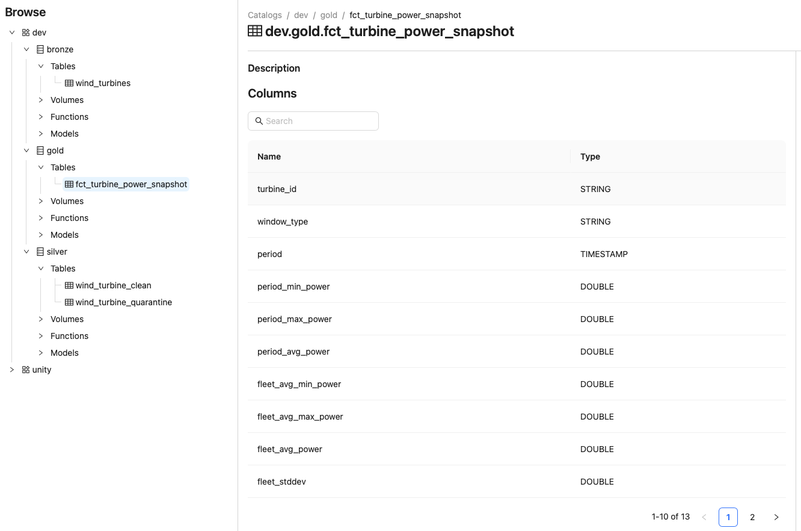

# Unity Catalog (OSS) Setup

This directory contains tooling for the local [Open Source Unity Catalog](https://github.com/unitycatalog/unitycatalog) server that provides table discovery, schema tracking, and lineage for the ColibriLocal pipeline.

## What Unity Catalog adds

| Problem | Without UC | With UC |
|---|---|---|
| Discovery | Must know exact Delta path | `unity.wind_turbines.bronze_wind_turbines` |
| Path decoupling | Hard-coded paths in every script | Table name resolves to path via UC |
| Schema drift | No history | UC stores schema per version |
| Lineage | None | UC tracks producer → table relationships |
| Access control | Filesystem only | Column-level grants via UC |

## Architecture

The pipeline writes Delta tables directly to disk as normal. Table registration in UC is a **separate, one-time step** performed via the UC CLI after the pipeline has run for the first time. This avoids any Spark version dependency on the UC connector JAR.

```
colibri-pipeline          →  Delta tables written to data/delta/
uc/register_tables.sh     →  UC CLI registers each table (name → path)
uc/list_tables.sh         →  UC CLI lists/describes registered tables
```

## Prerequisites

- **JDK 17** — required by the UC server.

  ```bash
  java --version   # should show openjdk 17
  ```

  If not, add the following to `~/.zshrc` (already done if you followed the project setup):

  ```bash
  export JAVA_HOME=/opt/homebrew/opt/openjdk@17
  export PATH="$JAVA_HOME/bin:$PATH"
  ```

- **`UC_HOME` env var** pointing to the unitycatalog repo root (already in `~/.zshrc`):

  ```bash
  export UC_HOME=~/Documents/Repos/unitycatalog
  ```

## Starting the UC server

Open a dedicated terminal and run:

```bash
cd $UC_HOME
bin/start-uc-server
```

The server listens on **http://localhost:8080** by default. This terminal must stay open while you interact with UC. To stop it, press `Ctrl+C`.

> Metadata is persisted in `$UC_HOME/etc/db/h2db.mv.db`, so registered tables survive server restarts.

## Workflow

**Step 1 — Run the pipeline** to write Delta tables to disk:

```bash
colibri-pipeline
```

**Step 2 — Register tables in UC** (once, after the first pipeline run):

```bash
uc/register_tables.sh
```

This creates the `unity.wind_turbines` schema and registers all four tables by pointing UC at their Delta paths. Subsequent runs are idempotent — already-registered tables are skipped.

**Step 3 — Verify**:

```bash
uc/list_tables.sh
```

## UC UI

The OSS UC server ships with a web UI at **http://localhost:3000** (requires the UI to be started separately):

```bash
cd $UC_HOME/ui
yarn install
yarn start
```


## Catalog / schema layout

```
dev                            ← catalog
├── bronze                     ← schema
│   └── wind_turbines
├── silver                     ← schema
│   ├── wind_turbine_clean
│   └── wind_turbine_quarantine
└── gold                       ← schema
    └── fct_turbine_power_snapshot
```
